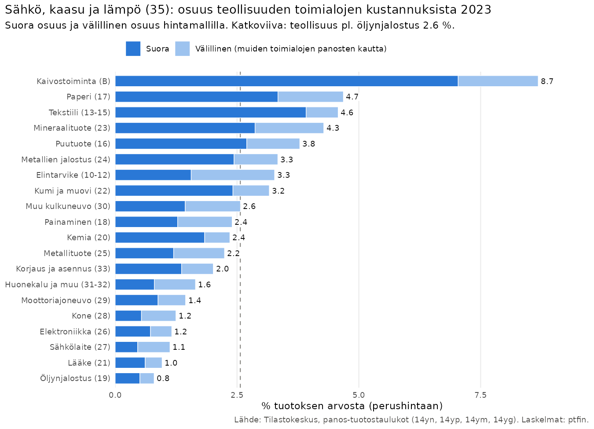
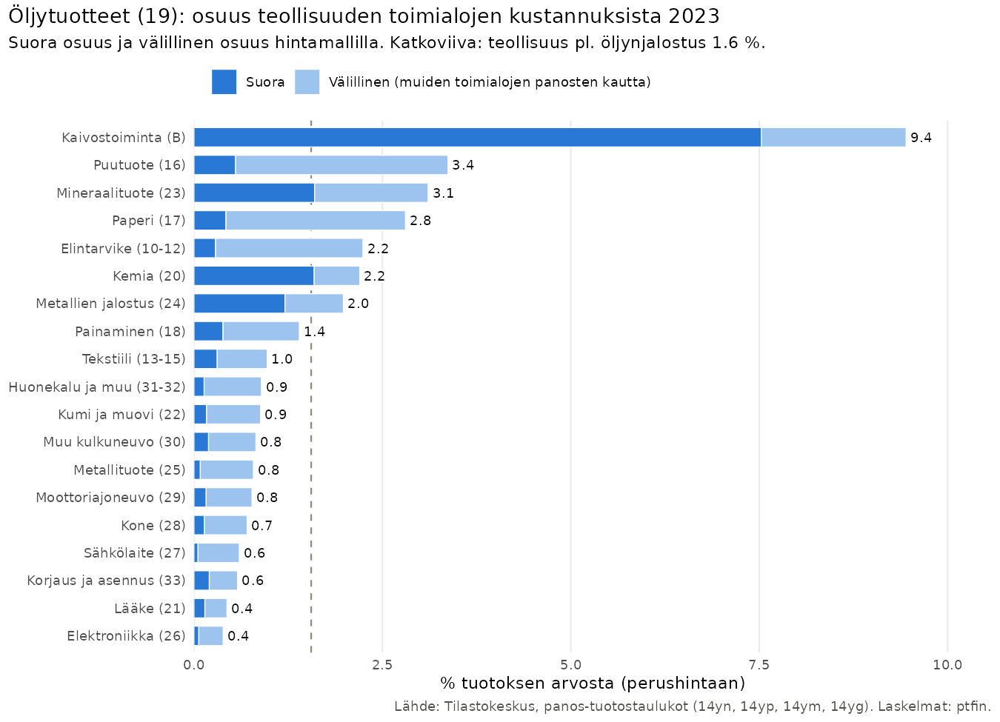
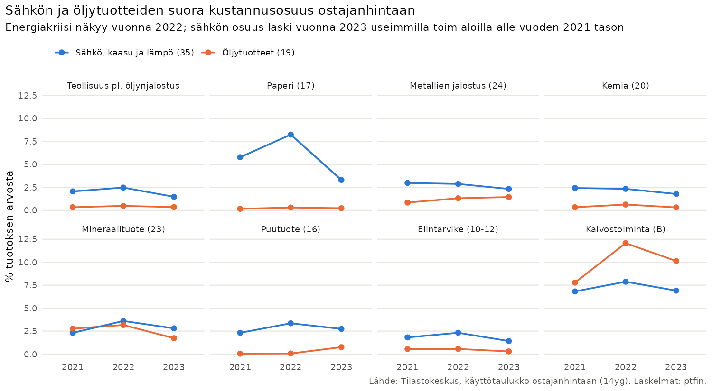

# Sähkö ja öljy teollisuuden toimialojen kustannusrakenteessa

Aineisto: Tilastokeskuksen panos-tuotostaulukot 2021–2023 (StatFin 14yn, 14ym,
14yg, 14yp) ja teollisuuden energiankäyttötilasto (tene/11wy). Laskelmat on
tehty `ptfin`-paketilla, skripti `analyysi/sahko_oljy.R`. Luvut ovat osuuksia
toimialan **tuotoksen arvosta** eli kaikista kustannuksista, joihin on
laskettu mukaan myös palkat, poistot ja toimintaylijäämä.

## Määritelmät

* **Sähkö** = tuote 35 *Sähkö, kaasu, lämpö ja ilmastointi*. Panos-tuotostaulukoissa
  sähköä ei ole eroteltu kaukolämmöstä eikä verkkokaasusta, joten luku on sähkön
  ja muun energiahuollon tuotteiden yläraja. Energiatilaston mukaan sähkö on
  teollisuudessa suurempi kuin lämpö (26,8 TWh vs. 13,2 TWh vuonna 2023).
* **Öljy** = tuote 19 *Koksi ja jalostetut öljytuotteet* (polttoaineet, raskas
  polttoöljy, nafta ym.). Raakaöljy kuuluu tuotteeseen 05–09, ja sitä käyttää
  käytännössä vain öljynjalostus (C19), jonka tuotoksesta raakaöljy ja muut
  kaivostuotteet ovat 58 % (2023). Siksi öljynjalostus on jätetty pois
  teollisuuden yhteenlasketusta luvusta.
* **Suora osuus** = toimialan omat ostot. Ostajanhintaan (14yg) hintaan sisältyvät
  tuoteverot (esim. sähkö- ja polttoaineverot) sekä kauppa- ja kuljetusmarginaalit,
  perushintaan (14ym) nämä eivät sisälly hintaan.
* **Kokonaisosuus** = suora osuus + välillinen osuus. Välillinen osuus on se
  sähkö tai öljy, joka tulee mukana muiden kotimaisten toimialojen toimittamissa
  välituotteissa, esimerkiksi kuljetuksissa tai puuraaka-aineessa.
  Kokonaisosuus lasketaan Leontiefin hintamallilla (`pt_total_input_share()`)
  perushintaan symmetrisestä taulukosta. Kotimaisen toimittajan (D35 tai C19) ja
  tuonnin (tuote 35 tai 19) hinnat nostetaan 100 %, ja kokonaisvaikutus hintoihin
  on sama kuin kokonaiskustannusosuus.

## Keskeiset tulokset (2023)

1. **Sähkö on teollisuudelle öljyä suurempi kustannuserä.** Kun öljynjalostusta
   ei lasketa mukaan, teollisuus käytti sähkö-, kaasu- ja lämpötuotteita 1,5 %
   tuotoksensa arvosta (ostajanhintaan, 2,0 mrd. e) ja öljytuotteita 0,35 %
   (0,5 mrd. e). Kun välilliset panokset lasketaan mukaan, osuudet ovat 2,6 % ja 1,6 %.
2. **Sähkö on pääosin suora kustannus, öljy pääosin välillinen.** Sähkön
   kokonaisosuudesta noin 64 % on toimialan omaa ostoa. Öljyn
   kokonaisosuudesta noin kaksi kolmasosaa tulee muiden toimialojen kautta.
   Tärkeimmät kanavat ovat maaliikenne (H49), metsätalous ja puunkorjuu (A02)
   sekä maatalous (A01). Esimerkiksi puutuoteteollisuudessa öljyn
   kokonaisosuudesta 52 % tulee puunkorjuun ja 19 % kuljetusten kautta.
   Paperiteollisuudessa vastaavat osuudet ovat 37 % ja 30 %, elintarviketeollisuudessa
   maatalouden kautta 42 % ja kuljetusten kautta 26 %.
3. **Sähköintensiivisimmät toimialat** (kokonaisosuus): kaivostoiminta 8,7 %, paperi 4,7 %,
   tekstiili 4,6 %, ei-metalliset mineraalituotteet 4,3 %, puutuote 3,8 %,
   metallien jalostus 3,3 % ja elintarvike 3,3 %. Konepaja- ja
   elektroniikkateollisuudessa osuus on noin 1 %.
4. **Öljyintensiivisimmät toimialat**: kaivostoiminta 9,4 % (työkoneiden diesel),
   puutuote 3,4 %, mineraalituotteet 3,1 %, paperi 2,8 %, elintarvike 2,2 % ja
   kemia 2,2 %. Suora öljyn käyttö on merkittävää vain kaivostoiminnassa sekä
   mineraalituote-, kemian- ja metalliteollisuudessa.
5. **Herkkyys hinnanmuutoksille.** Hintamalli on lineaarinen, joten 10 %:n
   hinnannousu nostaa kustannuksia kymmenesosan kokonaisosuudesta, jos
   nousu siirtyy täysimääräisesti hintoihin eikä panoksia korvata muilla.
   Sähkön 10 %:n kallistuminen nostaisi teollisuuden kustannuksia keskimäärin
   0,26 %, paperiteollisuudessa 0,47 % ja kaivostoiminnassa 0,87 %. Öljytuotteiden
   10 %:n kallistuminen nostaisi teollisuuden kustannuksia 0,16 %.
6. **Tuonti ja verot.** Teollisuuden käyttämistä öljytuotteista 73 % oli
   tuontia (perushintaan). Sähkö-, kaasu- ja lämpötuotteista tuontia oli vain 2 %
   vuonna 2023, kun vuosina 2021–2022 osuus oli 13–17 %. Suomi muuttui
   vuonna 2023 sähkön nettoviejäksi, mihin vaikutti muun muassa Olkiluoto 3. Verojen ja marginaalien osuus
   ostajanhinnasta on öljytuotteissa 16 % ja sähkössä 4 %. Teollisuuden
   sähkövero on alempi (veroluokka II).

## Kehitys 2021–2023: energiakriisi

| Teollisuus pl. öljynjalostus | 2021 | 2022 | 2023 |
|---|---|---|---|
| Sähkö, suora osuus ostajanhintaan | 2,06 % | 2,48 % | 1,48 % |
| Sähkö, kokonaisosuus perushintaan | 3,33 % | 3,90 % | 2,57 % |
| Öljy, suora osuus ostajanhintaan | 0,34 % | 0,49 % | 0,35 % |
| Öljy, kokonaisosuus perushintaan | 1,11 % | 1,79 % | 1,56 % |

Vuoden 2022 energiakriisi nosti sähkön osuutta eniten paperiteollisuudessa
(kokonaisosuus 7,6 % → 10,4 %). Vuonna 2023 osuus laski 4,7 %:iin, selvästi
vuoden 2021 tason alle, kun sähkön hinta laski.
Öljytuotteiden kokonaisosuus jäi vuonna 2023 lähes vuoden 2022 tasolle.
Välillinen osuus pysyi korkeana varsinkin metsäteollisuudessa.

## Fyysinen energiankäyttö (täydentävä tieto)

Teollisuuden energiankäyttötilaston mukaan sähkön osuus teollisuuden
energiankäytöstä oli 21 % ja öljyn 10 % vuonna 2023 (`tulokset/energiankaytto.csv`).
Metsäteollisuudessa sähkön osuus on vain 12 %, koska se käyttää paljon puupolttoaineita.
Kemianteollisuudessa (19–22) öljyn osuus on 41 %. Luku sisältää todennäköisesti
myös jalostamon oman polttoaineen käytön. Tuotteen 35 hankinnat jaettuna sähkön ja lämmön
käytöllä antavat vuonna 2023 useimmissa toimialaryhmissä noin 35–120 e/MWh. Tämä on vain karkea
tarkistus, koska rahamääräisessä tiedossa on mukana myös kaasu ja
teollisuuden oma sähköntuotanto ei näy ostoina.

## Rajoitukset

* Panos-tuotostaulukko on yhden vuoden rakenne, jossa panossuhteet ovat kiinteät.
  Hintamalli olettaa, että kustannukset siirtyvät täysimääräisesti hintoihin
  eikä panoksia korvata muilla. Sen tulos on siksi lyhyen aikavälin yläraja.
* Tuote 35 sisältää kaukolämmön ja kaasun. Sähkön osuus on siis yliarvio etenkin
  toimialoilla, jotka käyttävät paljon höyryä tai maakaasua (kemia,
  mineraalituotteet, elintarvike).
* Teollisuuden oma sähkön- ja lämmöntuotanto, esimerkiksi metsäteollisuuden
  voimalaitokset, ei näy sähköostoina. Sen kustannukset ovat polttoaineissa,
  kuten puussa ja maakaasussa. Mankala-periaatteella omakustannushintaan hankittu
  sähkö näkyy lähtökohtaisesti ostoina.
* Käyttötaulukon (tuotepohjainen) ja symmetrisen taulukon (toimialapohjainen)
  suorat osuudet eroavat hieman sivutuotteiden käsittelyn vuoksi
  (`yhteenveto_2023.csv`: sarakkeet `_ph` ja `_pt`). Suurin ero on kemiassa, jossa
  öljynjalostuksen toimialan tuotos sisältää myös kemikaaleja.

## Tiedostot

| Tiedosto | Sisältö |
|---|---|
| `tulokset/yhteenveto_2023.csv` | Suorat osuudet (ostajanhinta `_oh`, perushinta `_ph`, symmetrinen taulukko `_pt`), kokonaisosuudet ja öljyn tuontiosuus, % |
| `tulokset/suorat_osuudet.csv` | Suorat osuudet 2021–2023, milj. e ja osuudet |
| `tulokset/kokonaisosuudet.csv` | Suora, välillinen ja kokonaisosuus 2021–2023 |
| `tulokset/kanavat_2023.csv` | Kolme tärkeintä välittymiskanavaa toimialoittain |
| `tulokset/energiankaytto.csv` | Energiankäyttö GWh, sähkön ja öljyn osuudet, energiaintensiteetti |
| `tulokset/raakaoljy_oljynjalostus.csv` | Raakaöljyn (05–09) osuus öljynjalostuksen tuotoksesta |
